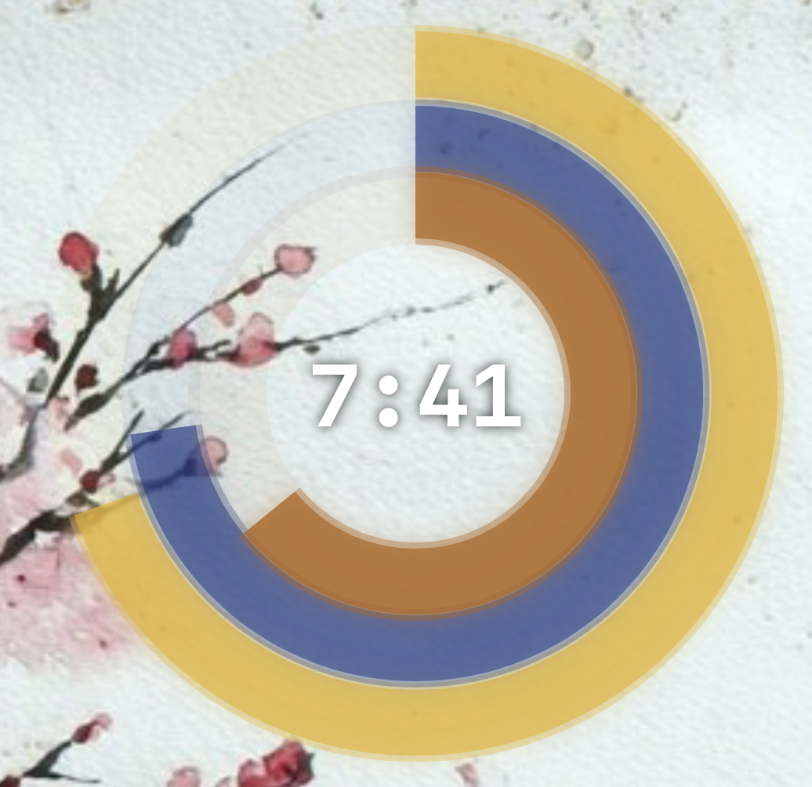

# Ring Clock

A beautiful, customizable desktop clock application for macOS featuring animated rings that display the current time.

## Screenshots

| Main Clock Display | Settings Panel |
|---|---|
|  |  |

## Features

### Time Display
- Analog rings for hours, minutes, and seconds with smooth animations
- Optional digital time display with customizable font size
- Clock spins 360 degrees in a random direction every minute

### Customization
- Color themes: Base, Moon, and Ghost in the Shell themes
- Custom colors: Create your own color schemes with RGB picker controls
- Theme management: Save, load, and delete custom themes
- Adjustable window opacity

### Multi-Time Zone Support
- Display clocks for different time zones simultaneously
- Add/remove time zones through settings
- Quick access to major cities (New York, London, Tokyo, etc.)

### Accessibility
- Screen reader support for all time rings
- Full keyboard accessibility

## Keyboard Shortcuts

- `Cmd+,`: Open Settings
- `Cmd+T`: Toggle between Base and Moon themes
- `Cmd+Click`: Capture screenshot
- `Cmd+Shift+T`: Take screenshot (menu option)

## Installation

1. Clone the repository
2. Open `Ring Clock.xcodeproj` in Xcode
3. Build and run the application

## Usage

### Basic Operation
- Theme selection: Use Cmd+T or Settings → Color Scheme
- Settings: Access via Cmd+, or click the app in menu bar
- Seconds toggle: Hover over clock or use Settings toggle

### Customization
- **Custom Colors**: Select "Custom" theme, then use color pickers
- **Themes**: Save current custom colors as named themes
- **Time Zones**: Add multiple time zones in Settings → Time Zones

### Keyboard Shortcuts
- `Cmd+,`: Open Settings
- `Cmd+T`: Toggle between Base and Moon themes

## Development

### TDD Approach
This project follows Test-Driven Development principles:
- Write failing tests first
- Implement minimal code to pass tests
- Refactor while maintaining test coverage

### Code Quality
- SwiftLint for code style enforcement
- Comprehensive unit tests
- Conventional commits for version control

### Build Tasks
```bash
task build        # Build in Debug configuration
task build-release # Build in Release configuration
task run          # Build and run app
task stop         # Stop running app
```

## Architecture

### ClockManager
Central state management class handling:
- Time calculations and progress values
- Color theme management
- User preferences storage
- Animation state

### Views
- **ContentView**: Main clock display with conditional layouts
- **SettingView**: Configuration interface
- **TimeZoneClock**: Individual time zone displays
- **TimeRing**: Reusable ring component with shadow effects

## Roadmap

- [WIP] Rendering of clock arms per current local time

## Contributing

1. Follow TDD: Write tests before implementation
2. Use conventional commits: `feat:`, `fix:`, `refactor:`, etc.
3. Run `task build` before committing
4. Ensure all tests pass

## License

This project is open source and available under the MIT License.